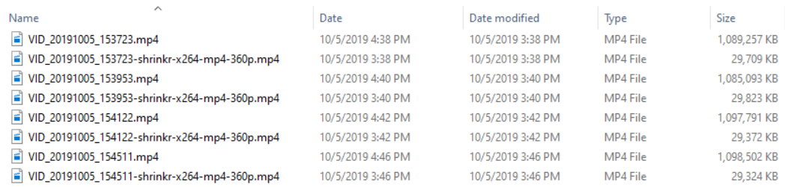

# Shrinkr Batch Transcode (Python Edition)

This Python script batch transcodes a source set of video files to a target set 
of proxy video files at a lower resolution.

```
usage: Shrinkr.py [-h] [--go] [--jobfile JOBFILE] [-v V]

Transcode a bunch of videos into smaller proxy video files
for easier viewing and editing, without redoing files unnecessarily.

Safety first:
Pass the --go option to actually run the generated transcoder commands!

optional arguments:
  -h, --help         show this help message and exit
  --go               actually run the transcoder commands (default: False)
  --jobfile JOBFILE  specify other jobfile (default: ShrinkrJob.json)
  -v V               set the debug output level (0 = INFO, 1 = DEBUG)
                     (default: 0)
```

_This script will not repeat the transcode if the output video file 
exists and matches the duration of the source video file_. 
You can run this script over and over again on a folder and only 
the new files that need conversion will be processed.


## 5 Steps

1. Read `ShrinkrOutputProfiles.json`, add new `ffmpeg` commands if needed
1. Edit `ShrinkrJob.json`
1. Run `python Shrinkr.py` to see which files it will transcode (dry run)
1. Run `python Shrinkr.py --go` to transcode those files
1. Add files to the video folders, rinse and repeat.

## Prerequisites

1. [Python 3](https://www.python.org/downloads/)
1. ffmpeg in the PATH &mdash; [Windows](https://ffmpeg.zeranoe.com/builds/), [macOS](https://formulae.brew.sh/formula/ffmpeg), [Ubuntu](https://snapcraft.io/ffmpeg)

## How It Works

The files can be selected for transcoding based on the following
characteristics:

- Source Folder(s)
- Codec (HEVC, H.264, etc.)
- Resolution (2160p, 1440p, 1080p, etc.)

Using a config file, the script will seek out and select
all of the files in the specified Folder(s) that match the supplied 
Codec(s) and Resolution(s).

The script will set the Last Modified time of each transcoded video file 
to the timestamp from the source video file, so that sorting by Date Modified 
in Windows Explorer, macOS Finder, or GNOME Files will also show the two files 
next to one another.



(Windows Explorer has odd behavior, though. The default "Date" column adds 
in Daylight Savings Time, _which makes for a confusing and inconsistent view of the world_. 
I seriously don't know what Microsoft is telling me here, because the 
actual `mtime` value is the same. The "Date modified" column shows things correctly, though.)

## Job File

The default job file `ShrinkrJob.json` looks like this and 
the fields should be pretty self-explanatory:

```json
{
    "input_folders": ["~/Downloads/Vid", "~/Videos/FirstOne"],
    "input_exts": ["*.mp4", "*.mov", "*.mkv"],

    "select_codecs": ["hevc"],
    "select_heights": [2160],

    "output_profiles": ["x264-mp4-360p", "utvideo-mkv-360p"]
}
```

`input_folders`: The list of folders containing files to transcode. 
The `~` symbol will automatically be replaced with the User's Home Folder 
path on both Windows, Linux, and macOS.

`input_exts`: The list of file types to transcode.

`select_codecs`: The list of input video codecs to transcode.

`select_heights`: The list of input video heights to transcode.

`output_profiles`: The list of target transcoding profiles defined 
in the `ShrinkrOutputProfiles.json` file.

To tell Shrinkr to load a custom Job File, use the command-line 
option `--jobfile YourCustomJob.json`.

## Sample Output

By default, `Shrinkr.py` will load `ShrinkrJob.json` and process 
its specified files.

```
C:\Shrinkr>\Python37\python.exe Shrinkr.py --go

Shrinkr -------------------------------------------------------------
Find all input files specified via the 'ShrinkrJob.json' jobfile
with folders    ['~/Downloads/Vid', '~/Videos/FirstOne']
with extensions ['*.mp4', '*.mov', '*.mkv']
---------------------------------------------------------------------

Getting file info for "C:\Users\Max\Downloads\Vid\2160p-to-1080p-24mbps-1-color-correction.mp4"
Getting file info for "C:\Users\Max\Downloads\Vid\2160p-to-1080p-24mbps-1.mp4"
Getting file info for "C:\Users\Max\Downloads\Vid\2160p-to-1080p.mp4"
Getting file info for "C:\Users\Max\Downloads\Vid\2160p-to-1440p-80mbps.mp4"
Getting file info for "C:\Users\Max\Downloads\Vid\2160p-to-2160p.mp4"
Getting file info for "C:\Users\Max\Downloads\Vid\2160p-to-540p-4mbps.mp4"
Getting file info for "C:\Users\Max\Downloads\Vid\2160p-to-720p-8mbps-1-color-correction.mp4"
Getting file info for "C:\Users\Max\Downloads\Vid\2160p-to-720p-8mbps-1.mp4"
Getting file info for "C:\Users\Max\Downloads\Vid\2160p-to-720p-8mbps-2.mp4"
Getting file info for "C:\Users\Max\Downloads\Vid\2160p-to-720p-8mbps-3.mp4"
Getting file info for "C:\Users\Max\Downloads\Vid\2160p-to-720p-8mbps-4-brightness.mp4"
Getting file info for "C:\Users\Max\Downloads\Vid\2160p-to-720p-8mbps-4-gamma.mp4"
Getting file info for "C:\Users\Max\Downloads\Vid\2160p-to-720p-8mbps-4-nofilter.mp4"
Getting file info for "C:\Users\Max\Downloads\Vid\2160p-to-720p-8mbps-4.mp4"
Getting file info for "C:\Users\Max\Downloads\Vid\VID_20190713_184142.mp4"
Getting file info for "C:\Users\Max\Downloads\Vid\VID_20190713_184213.mp4"
Getting file info for "C:\Users\Max\Downloads\Vid\VID_20190713_184234.mp4"
Getting file info for "C:\Users\Max\Downloads\Vid\VID_20190713_184335.mp4"
Getting file info for "C:\Users\Max\Downloads\Vid\VID_20190713_184418.mp4"
Getting file info for "C:\Users\Max\Downloads\Vid\VID_20190713_184906.mp4"
Getting file info for "C:\Users\Max\Downloads\Vid\h264-1080p30-24mbps.mp4"
Getting file info for "C:\Users\Max\Downloads\Vid\hevc-1080p24-33mbps.mp4"
Getting file info for "C:\Users\Max\Downloads\Vid\hevc-2160p24-40mbps.mp4"
Getting file info for "C:\Users\Max\Downloads\Vid\hevc-2160p30-80mbps.mp4"
Getting file info for "C:\Users\Max\Videos\FirstOne\FirstOne.mp4"
Getting file info for "C:\Users\Max\Videos\FirstOne\VID_20190713_184142 - Converted.mkv"
Getting file info for "C:\Users\Max\Videos\FirstOne\VID_20190721_130806 - Converted.mov"

Shrinkr -------------------------------------------------------------
Generate transcode commands, check which output files already exist

Obviously we won't need to transcode those files again if they match
the input file duration
---------------------------------------------------------------------

Getting file info for "C:\Users\Max\Downloads\Vid\VID_20190713_184142.mp4"
Getting file info for "C:\Users\Max\Downloads\Vid\VID_20190713_184142-shrinkr-x264-mp4-360p.mp4"
File "C:\Users\Max\Downloads\Vid\VID_20190713_184142.mp4" has already been transcoded to x264-mp4-360p
Getting file info for "C:\Users\Max\Downloads\Vid\VID_20190713_184142.mp4"
Getting file info for "C:\Users\Max\Downloads\Vid\VID_20190713_184142-shrinkr-utvideo-mkv-360p.mkv"
File "C:\Users\Max\Downloads\Vid\VID_20190713_184142.mp4" has already been transcoded to utvideo-mkv-360p
Getting file info for "C:\Users\Max\Downloads\Vid\VID_20190713_184213.mp4"
Getting file info for "C:\Users\Max\Downloads\Vid\VID_20190713_184213-shrinkr-x264-mp4-360p.mp4"
File "C:\Users\Max\Downloads\Vid\VID_20190713_184213.mp4" has already been transcoded to x264-mp4-360p
Getting file info for "C:\Users\Max\Downloads\Vid\VID_20190713_184213.mp4"
Getting file info for "C:\Users\Max\Downloads\Vid\VID_20190713_184213-shrinkr-utvideo-mkv-360p.mkv"
File "C:\Users\Max\Downloads\Vid\VID_20190713_184213.mp4" has already been transcoded to utvideo-mkv-360p
Getting file info for "C:\Users\Max\Downloads\Vid\VID_20190713_184234.mp4"
Getting file info for "C:\Users\Max\Downloads\Vid\VID_20190713_184234-shrinkr-x264-mp4-360p.mp4"
File "C:\Users\Max\Downloads\Vid\VID_20190713_184234.mp4" has already been transcoded to x264-mp4-360p
Getting file info for "C:\Users\Max\Downloads\Vid\VID_20190713_184234.mp4"
Getting file info for "C:\Users\Max\Downloads\Vid\VID_20190713_184234-shrinkr-utvideo-mkv-360p.mkv"
File "C:\Users\Max\Downloads\Vid\VID_20190713_184234.mp4" has already been transcoded to utvideo-mkv-360p
Getting file info for "C:\Users\Max\Downloads\Vid\VID_20190713_184335.mp4"
Getting file info for "C:\Users\Max\Downloads\Vid\VID_20190713_184335.mp4"
Getting file info for "C:\Users\Max\Downloads\Vid\VID_20190713_184418.mp4"
Getting file info for "C:\Users\Max\Downloads\Vid\VID_20190713_184418.mp4"
Getting file info for "C:\Users\Max\Downloads\Vid\VID_20190713_184906.mp4"
Getting file info for "C:\Users\Max\Downloads\Vid\VID_20190713_184906.mp4"
Getting file info for "C:\Users\Max\Downloads\Vid\hevc-2160p24-40mbps.mp4"
Getting file info for "C:\Users\Max\Downloads\Vid\hevc-2160p24-40mbps.mp4"
Getting file info for "C:\Users\Max\Downloads\Vid\hevc-2160p30-80mbps.mp4"
Getting file info for "C:\Users\Max\Downloads\Vid\hevc-2160p30-80mbps.mp4"

Shrinkr -------------------------------------------------------------
Execute -- these are the transcoding commands that will be executed:
---------------------------------------------------------------------

ffmpeg -y -i C:\Users\Max\Downloads\Vid\VID_20190713_184335.mp4 -c:v libx264 -profile:v main -filter:v scale=-2:360 -b:v 4M -c:a copy C:\Users\Max\Downloads\Vid\VID_20190713_184335-shrinkr-x264-mp4-360p.mp4
ffmpeg -y -i C:\Users\Max\Downloads\Vid\VID_20190713_184335.mp4 -c:v utvideo -filter:v scale=-2:360 -c:a copy C:\Users\Max\Downloads\Vid\VID_20190713_184335-shrinkr-utvideo-mkv-360p.mkv
ffmpeg -y -i C:\Users\Max\Downloads\Vid\VID_20190713_184418.mp4 -c:v libx264 -profile:v main -filter:v scale=-2:360 -b:v 4M -c:a copy C:\Users\Max\Downloads\Vid\VID_20190713_184418-shrinkr-x264-mp4-360p.mp4
ffmpeg -y -i C:\Users\Max\Downloads\Vid\VID_20190713_184418.mp4 -c:v utvideo -filter:v scale=-2:360 -c:a copy C:\Users\Max\Downloads\Vid\VID_20190713_184418-shrinkr-utvideo-mkv-360p.mkv
ffmpeg -y -i C:\Users\Max\Downloads\Vid\VID_20190713_184906.mp4 -c:v libx264 -profile:v main -filter:v scale=-2:360 -b:v 4M -c:a copy C:\Users\Max\Downloads\Vid\VID_20190713_184906-shrinkr-x264-mp4-360p.mp4
ffmpeg -y -i C:\Users\Max\Downloads\Vid\VID_20190713_184906.mp4 -c:v utvideo -filter:v scale=-2:360 -c:a copy C:\Users\Max\Downloads\Vid\VID_20190713_184906-shrinkr-utvideo-mkv-360p.mkv
ffmpeg -y -i C:\Users\Max\Downloads\Vid\hevc-2160p24-40mbps.mp4 -c:v libx264 -profile:v main -filter:v scale=-2:360 -b:v 4M -c:a copy C:\Users\Max\Downloads\Vid\hevc-2160p24-40mbps-shrinkr-x264-mp4-360p.mp4
ffmpeg -y -i C:\Users\Max\Downloads\Vid\hevc-2160p24-40mbps.mp4 -c:v utvideo -filter:v scale=-2:360 -c:a copy C:\Users\Max\Downloads\Vid\hevc-2160p24-40mbps-shrinkr-utvideo-mkv-360p.mkv
ffmpeg -y -i C:\Users\Max\Downloads\Vid\hevc-2160p30-80mbps.mp4 -c:v libx264 -profile:v main -filter:v scale=-2:360 -b:v 4M -c:a copy C:\Users\Max\Downloads\Vid\hevc-2160p30-80mbps-shrinkr-x264-mp4-360p.mp4
ffmpeg -y -i C:\Users\Max\Downloads\Vid\hevc-2160p30-80mbps.mp4 -c:v utvideo -filter:v scale=-2:360 -c:a copy C:\Users\Max\Downloads\Vid\hevc-2160p30-80mbps-shrinkr-utvideo-mkv-360p.mkv

Shrinkr -------------------------------------------------------------
Running Transcodes
---------------------------------------------------------------------

Running: ffmpeg -y -i C:\Users\Max\Downloads\Vid\VID_20190713_184335.mp4 -c:v libx264 -profile:v main -filter:v scale=-2:360 -b:v 4M -c:a copy C:\Users\Max\Downloads\Vid\VID_20190713_184335-shrinkr-x264-mp4-360p.mp4
Done
Set transcoded file's Date Modified to Sat Jul 13 18:43:51 2019
Running: ffmpeg -y -i C:\Users\Max\Downloads\Vid\VID_20190713_184335.mp4 -c:v utvideo -filter:v scale=-2:360 -c:a copy C:\Users\Max\Downloads\Vid\VID_20190713_184335-shrinkr-utvideo-mkv-360p.mkv
Done
Set transcoded file's Date Modified to Sat Jul 13 18:43:51 2019
Running: ffmpeg -y -i C:\Users\Max\Downloads\Vid\VID_20190713_184418.mp4 -c:v libx264 -profile:v main -filter:v scale=-2:360 -b:v 4M -c:a copy C:\Users\Max\Downloads\Vid\VID_20190713_184418-shrinkr-x264-mp4-360p.mp4
Done
Set transcoded file's Date Modified to Sat Jul 13 18:44:34 2019
Running: ffmpeg -y -i C:\Users\Max\Downloads\Vid\VID_20190713_184418.mp4 -c:v utvideo -filter:v scale=-2:360 -c:a copy C:\Users\Max\Downloads\Vid\VID_20190713_184418-shrinkr-utvideo-mkv-360p.mkv
Done
Set transcoded file's Date Modified to Sat Jul 13 18:44:34 2019
Running: ffmpeg -y -i C:\Users\Max\Downloads\Vid\VID_20190713_184906.mp4 -c:v libx264 -profile:v main -filter:v scale=-2:360 -b:v 4M -c:a copy C:\Users\Max\Downloads\Vid\VID_20190713_184906-shrinkr-x264-mp4-360p.mp4
Done
Set transcoded file's Date Modified to Sat Jul 13 18:49:17 2019
Running: ffmpeg -y -i C:\Users\Max\Downloads\Vid\VID_20190713_184906.mp4 -c:v utvideo -filter:v scale=-2:360 -c:a copy C:\Users\Max\Downloads\Vid\VID_20190713_184906-shrinkr-utvideo-mkv-360p.mkv
Done
Set transcoded file's Date Modified to Sat Jul 13 18:49:17 2019
Running: ffmpeg -y -i C:\Users\Max\Downloads\Vid\hevc-2160p24-40mbps.mp4 -c:v libx264 -profile:v main -filter:v scale=-2:360 -b:v 4M -c:a copy C:\Users\Max\Downloads\Vid\hevc-2160p24-40mbps-shrinkr-x264-mp4-360p.mp4
Done
Set transcoded file's Date Modified to Fri Jul 12 15:38:51 2019
Running: ffmpeg -y -i C:\Users\Max\Downloads\Vid\hevc-2160p24-40mbps.mp4 -c:v utvideo -filter:v scale=-2:360 -c:a copy C:\Users\Max\Downloads\Vid\hevc-2160p24-40mbps-shrinkr-utvideo-mkv-360p.mkv
Done
Set transcoded file's Date Modified to Fri Jul 12 15:38:51 2019
Running: ffmpeg -y -i C:\Users\Max\Downloads\Vid\hevc-2160p30-80mbps.mp4 -c:v libx264 -profile:v main -filter:v scale=-2:360 -b:v 4M -c:a copy C:\Users\Max\Downloads\Vid\hevc-2160p30-80mbps-shrinkr-x264-mp4-360p.mp4
Done
Set transcoded file's Date Modified to Sat Jul 13 16:00:17 2019
Running: ffmpeg -y -i C:\Users\Max\Downloads\Vid\hevc-2160p30-80mbps.mp4 -c:v utvideo -filter:v scale=-2:360 -c:a copy C:\Users\Max\Downloads\Vid\hevc-2160p30-80mbps-shrinkr-utvideo-mkv-360p.mkv
Done
Set transcoded file's Date Modified to Sat Jul 13 16:00:17 2019
```

# Shrinkr Batch Transcode (SCons Edition)

The `ShrinkrProxy` and `ShrinkrArchive` [SCons build
scripts](https://scons.org/) will transcode a source set of video files to a
target set of proxy or archival video files.

To use them, simply place them in a folder of video files, then run:

```
scons -f Shrinker{Proxy, Archive}
```

You'll see something like:

```
C:\Users\Max\Videos\Captures\test>scons -f ShrinkrArchive
scons: Reading SConscript files ...
Checking *.mp4
Checking *.mkv
Archive: 20200706-203752-NV12-60fps.mkv -> 20200706-203752-NV12-60fps-archive.mkv
Archive: 20200706-203937-NV12-60fps.mkv -> 20200706-203937-NV12-60fps-archive.mkv
Archive: 20200706-204108-NV12-60fps.mkv -> 20200706-204108-NV12-60fps-archive.mkv
scons: done reading SConscript files.
scons: Building targets ...
ffmpeg -benchmark -i 20200706-203752-NV12-60fps.mkv -c:v libx264 -crf 0 -preset veryslow -c:a copy -y 20200706-203752-NV12-60fps-archive.mkv

[... bunch of ffmpeg output ...]

scons: done building targets.
```

If you run it again, [SCons](https://scons.org/) looks at the timestamps and
checksums and decides there's nothing more to do:

```
scons: Reading SConscript files ...
Checking *.mp4
Checking *.mkv
Archive: 20200706-203752-NV12-60fps.mkv -> 20200706-203752-NV12-60fps-archive.mkv
Archive: 20200706-203937-NV12-60fps.mkv -> 20200706-203937-NV12-60fps-archive.mkv
Archive: 20200706-204108-NV12-60fps.mkv -> 20200706-204108-NV12-60fps-archive.mkv
scons: done reading SConscript files.
scons: Building targets ...
scons: `.' is up to date.
scons: done building targets.
```

Generating and managing proxy files by hand is not necessary for most non-linear
video editing packages nowadays, so the `ShrinkrProxy` script is only included
here for completeness. 

Archiving video files using `ShrinkrArchive` allows you to trade CPU time for
storage. For example, I use the `-preset ultrafast` flag when losslessly
recording screencasts using [OBS Studio](https://obsproject.com/). This
generates huge files. But then I postprocess those files for archival, using the
`-preset veryslow` option in `ffmpeg` to squeeze out as many redundant (low
entropy) bits as possible for long-term storage.

Here's what the file sizes look like pre- and post-archival:

```
 Volume in drive C has no label.
 Volume Serial Number is 4AB3-031B

 Directory of C:\Users\Max\Videos\Captures\test

11/06/2020  03:34 PM    <DIR>          .
11/06/2020  03:34 PM    <DIR>          ..
11/06/2020  03:34 PM             2,815 .sconsign.dblite
11/06/2020  03:05 PM        16,272,779 20200706-203752-NV12-60fps-archive.mkv
07/06/2020  07:38 PM        50,428,461 20200706-203752-NV12-60fps.mkv
11/06/2020  03:08 PM        11,622,567 20200706-203937-NV12-60fps-archive.mkv
07/06/2020  07:40 PM        38,754,440 20200706-203937-NV12-60fps.mkv
11/06/2020  03:25 PM        77,927,952 20200706-204108-NV12-60fps-archive.mkv
07/06/2020  07:45 PM       306,824,745 20200706-204108-NV12-60fps.mkv
11/06/2020  03:41 PM             1,784 ShrinkrArchive
               8 File(s)    501,835,543 bytes
               2 Dir(s)  225,023,504,384 bytes free
```

Savings of 66 - 75% are common for screencasts, which have large amounts of
low-entropy pixels (lots of solid color blocks), which can be redundantly
optimized out of the bitstream.

Checking the files with
[PSNR](https://en.wikipedia.org/wiki/Peak_signal-to-noise_ratio),
[SSIM](https://en.wikipedia.org/wiki/Structural_similarity), and
[VMAF](https://en.wikipedia.org/wiki/Video_Multimethod_Assessment_Fusion) after
archival shows that the files are identical (scores of 100 are basically
impossible with VMAF, but anything > 97 is subjectively identical):

```
[Parsed_psnr_1 @ 00000245e3565d40] PSNR y:inf u:inf v:inf average:inf min:inf max:inf
[Parsed_ssim_0 @ 00000245e35659c0] SSIM Y:1.000000 (inf) U:1.000000 (inf) V:1.000000 (inf) All:1.000000 (inf)
[libvmaf @ 099c27c0] VMAF score: 97.429299
```

Leveraging the [SCons](https://scons.org/) build system offers another way to
quickly specify the files to transcode and ensure that any changes are picked
up. This means I didn't need to write the original Python Edition above, but
hindsight is 20/20.

## Rationale

Since my computer is from the pre-Skylake generation, playback of HEVC-encoded
video is impossibly slow and editing is impossible without extra hardware support
or an additional discrete graphics card. (Which I'll buy eventually, just not 
this instant.)

This script lets me more easily trade storage for processing time.

`ffmpeg` doesn't quite have a feature that lets it intelligently redo incomplete transcodes
and preserve completed files, it is all-or-nothing when using *.mp4-style globs.

This script gives a little more flexibility when trying to transcode files down
to editable or even viewable sizes. Without 
[Gen 9 Intel Graphics](https://en.wikipedia.org/wiki/Intel_Graphics_Technology#Capabilities_(GPU_video_acceleration)), 
[Nvidia PureVideo 7](https://en.wikipedia.org/wiki/Nvidia_PureVideo#The_seventh_generation_PureVideo_HD), 
or [AMD Unified Video Decoder 6](https://en.wikipedia.org/wiki/Unified_Video_Decoder#UVD_6) fixed-function hardware acceleration, 
even a beefy CPU will have trouble smoothly playing back H.265 / HEVC-encoded video.

## License

```
Shrinkr Batch Transcode
Copyright (c) 2019 - 2020 Max Vilimpoc (https://fromplantoprototype.com)

Permission is hereby granted, free of charge, to any person obtaining a copy
of this software and associated documentation files (the "Software"), to deal
in the Software without restriction, including without limitation the rights
to use, copy, modify, merge, publish, distribute, sublicense, and/or sell
copies of the Software, and to permit persons to whom the Software is
furnished to do so, subject to the following conditions:

The above copyright notice and this permission notice shall be included in
all copies or substantial portions of the Software.

THE SOFTWARE IS PROVIDED "AS IS", WITHOUT WARRANTY OF ANY KIND, EXPRESS OR
IMPLIED, INCLUDING BUT NOT LIMITED TO THE WARRANTIES OF MERCHANTABILITY,
FITNESS FOR A PARTICULAR PURPOSE AND NONINFRINGEMENT. IN NO EVENT SHALL THE
AUTHORS OR COPYRIGHT HOLDERS BE LIABLE FOR ANY CLAIM, DAMAGES OR OTHER
LIABILITY, WHETHER IN AN ACTION OF CONTRACT, TORT OR OTHERWISE, ARISING FROM,
OUT OF OR IN CONNECTION WITH THE SOFTWARE OR THE USE OR OTHER DEALINGS IN
THE SOFTWARE.
```
